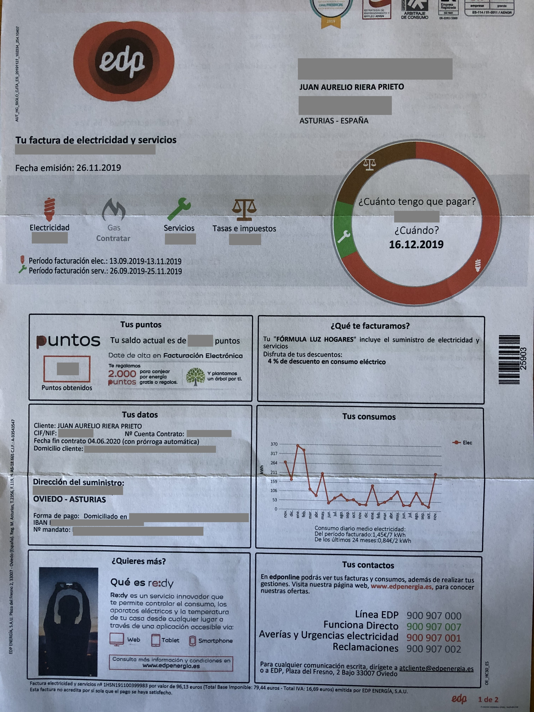

```{r setup, include=FALSE}
knitr::opts_chunk$set(echo = FALSE)
```

Durante los últimos años, he estado utilizando R para analizar los datos de producción de varias fábricas de queso, y ayudando a los equipos a utilizar esta herramienta. Este mes de noviembre me he jubilado, y he vuelto a Asturias. Una de las cosas que me han pasado por la cabeza estos días es si R también podría aportarme algo en el análisis de mi economía familiar. 

Mi primer ensayo casero con R ha sido el análisis de la factura eléctrica. EDP envía una factura muy detallada, como hacen actualmente casi todos los proveedores. Esta es mi factura de noviembre:


```{r, echo=FALSE, out.width = "60%"}

```

De esta factura, lo que me interesa especialmente es recuperar los datos de consumo, de forma que pueda reproducir la gráfica que me proporciona EDP en mi factura:


```{r, echo=FALSE, out.width = "100%"}
knitr::include_graphics('IMG_4184_detalle.JPG')
```

Para ello, he tenido que configurar mi cuenta de EDP, mi proveedor energético, para descargar mis lecturas de contador en formato CSV. Esto quiere decir que ya no tendré una copia en papel de la factura, pero a cambio dispongo de los datos.

Como siempre, cargo las librerías al principio, de forma que de un vistazo se pueda saber qué funciones estoy utilizando. Desde la aparición de las bibliotecas *tidy*, intento estandarizar todos los procesos a *tidyverse*

```{r , include=TRUE, echo = TRUE}
library(knitr)
library (tidyverse)
library(scales) # para ggplot
```

Al leer los datos a mi dataframe *df* me encuentro dos inconvenientes: uno, los nombres de las variables del CSV que proporciona EDP no son los que yo quiero, y dos, el campo de fecha es un campo de texto que necesito reformatear.

```{r , include=TRUE, echo = TRUE}

df <- read.csv2("2019-11 lecturas.csv", as.is = TRUE)
kable(head(df))
```

En primer lugar, renombro las columnas

```{r , include=TRUE, echo = TRUE}

names(df) <- c("fecha", "kWh_lectura", "origen", "facturada", "X")
```

y a continuación reemplazo la columna de fecha por tres columnas para el día, el mes y el año. Como hay un espacio inicial, creo una variable falsa con *NA* que recoja la primera columna, y paso el mes a minúsculas, me interesa para la conversión posterior a formato de fecha.

```{r , include=TRUE, echo = TRUE}

df <- df %>%
    separate(fecha, c(NA, "dia", "mes", "año"), " ") %>%
    select(dia, mes, año, kWh_lectura) %>%
    mutate(mes = tolower(mes)) %>%
    drop_na() 
```

Las fechas son uno de los tipos de columna que más lata dan al convertir datos de un formato a otro (Excel, CSV, Unix, etc). En R siempre es conveniente trabajar en el formato *Date* y para ello voy a convertir los campos de texto en fecha. Voy a usar el formato de mes con tres letras (reducido), pero en la versión en español de R este formato lleva un punto al final de la abreviatura (ene. feb. mar. etc), por lo que tengo que pegar el punto en la conversión.
Lo hago en dos pasos para más claridad, podría hacerlo en uno

```{r , include=TRUE, echo = TRUE}
df$fecha <- paste("20",df$año,"-", df$mes,".-", df$dia, sep="")
kable(head(df))
```

Una vez en formato correcto, la conversión en formato de fecha es directa y transparente:

```{r , include=TRUE, echo = TRUE}
df$fecha <- as.Date(df$fecha, format = "%Y-%b-%d") 
kable(head(df))
```

Ahora ya sólo queda calcular los consumos, como diferencia de dos lecturas sucesivas. La serie está ordenada de más antigua a más reciente, por lo que hay que hacer dos correcciones: 

* Cambiar de signo la diferencia calculada, ya que al restar el valor más antiguo (lectura anterior, valor más bajo) menos el más reciente (lectura actual, valor más alto), la diferencia es negativa, hay que cambiar el signo para obtener el valor diferencial de consumo en positivo

* Añadir a la serie un primer valor *NA* ya que la serie diferenciada tiene un término menos; el primer valor de la serie diferenciada es la diferencia entre el segundo y el primero, que se corresponde con el valor de consumo del *segundo* periodo). 

```{r , include=TRUE, echo = TRUE}
df <- df %>% 
  select(fecha, kWh_lectura)

df$consumo_kWh <- c(-diff(df$kWh_lectura), NA)
#df$consumo_kWh[1] <- NA
```

Y ya sólo queda representar los valores con una escala correctamente ordenada y legible en valores de dos meses

```{r , include=TRUE, echo = TRUE}
ggplot(df, aes(x = fecha, y = consumo_kWh)) +
  geom_line() +
  geom_point() +
  theme_bw() +
  scale_x_date(date_breaks = "2 month", labels = date_format("%b %y"))
```


Bien, finalmente he conseguido mi gáfica de consumos. Hay una pequeña diferencia respecto a la que me envió EDP debido a que EDP ha sumado en enero dos lecturas realizadas en enero, la última quincena del año 2018 y el propio mes de enero 2019.

Quedan algunas cuestiones para resolver:

+ Consultar a EDP si es posible disponer de lecturas más frecuentes, diarias o incluso horarias.

+ Hacer el cálculo económico del valor en kWh.

Esto será para otro día.